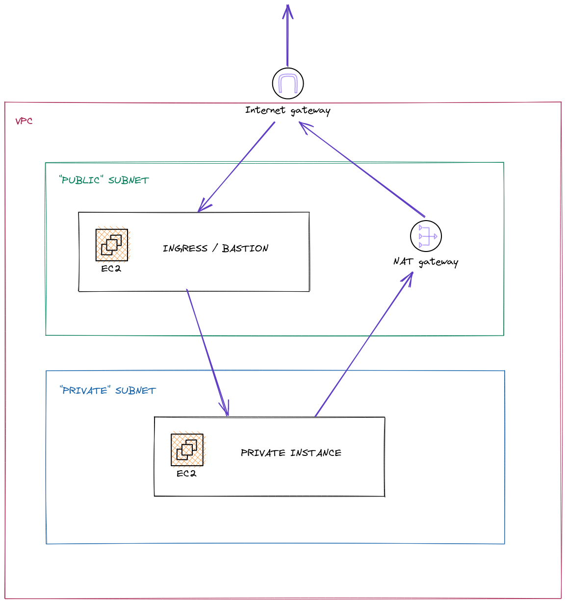

# Dojo ~ Environment blueprint with Terraform on AWS

In this dojo, you will learn how to organize your Terraform codebase using a blueprint pattern through a simple AWS infrastructure.

## Step 0: The tools you will need

For this exercise, you will need :

- An AWS account with a VPC
- [Terraform 1.1.9](https://learn.hashicorp.com/tutorials/terraform/install-cli)
- [AWS CLI v2](https://docs.aws.amazon.com/cli/latest/userguide/getting-started-install.html)

## Step 1: AAOps I have initialized my Terraform codebase

### Validation criterias

- [ ] I have which only uses the `blueprint` module
- [ ] I have a `aws_key_pair` in my terraform state
- [ ] I have directories for the following modules:
  - `dojo-blueprint`
  - `dojo-network`
  - `dojo-public-instance`
  - `dojo-private-instance`
  - `aws-ec2-ubuntu`

### How-to

1. Copy everything form [`initial-setup`](./initial-setup/).
2. Separate your CIDR in two equal parts. Select one which will represent a private subnet and one which will be the public one.
3. In each subnet, select an IP which will be the IP of the ec2 instance in this subnet.
4. Change values in the following files:

  - `layer/main.tf`
  - `modules/dojo-blueprint.tf`
  - `modules/dojo-network/main.tf`
  - `modules/dojo-private-instance/main.tf`
  - `modules/dojo-public-instance.tf`

5. Run `terraform init` then `terraform apply` in `layer`

## AAOps I have a public and a private subnet

### Validation criterias

- [ ] The `dojo-network` module creates 2 subnets and outputs them as long as the VPC
- [ ] I have two AWS subnets in the given VPC
- [ ] The subnets are in the terraform state
- [ ] The only terraform variable needed is `context`

### How-to

1. Go to `modules/dojo-network`
2. Use a [terraform `aws_vpc` data](https://registry.terraform.io/providers/hashicorp/aws/latest/docs/data-sources/vpc) to use the existing VPC in your codebase
3. Add the [terraform resources](https://registry.terraform.io/providers/hashicorp/aws/2.43.0/docs/resources/subnet) to create your two subnets
4. Add the terraform outputs to get th `vpc` the `public_subnet` and `private_subnet` objetcs
5. Run `terraform init` and `terraform apply` in `layer`

> Usualy, one would create the VPC in this module. But you cannot have more than 5 VPCs in the same AWS account. 
> So, for the purpose of this dojo I have already created a VPC which will be shared between the students.

## AAOps I have a public instance which I can use as a bastion host

### Validation criterias

- [ ] The `dojo-network` mdoule creates an internet gateway
- [ ] I have a `aws-ec2-ubuntu` module which allows me to create a Ubuntu EC2 instance
- [ ] The modules input are:
  - `name`
  - `private_ip`
  - `is_public`
  - `key_name`
  - `vpc`
  - `subnet`
  - `internet_gateway`
- [ ] The module outputs the instance public IP
- [ ] I have a `dojo-public-instance` module
- [ ] I have an internet gateway created with terraform
- [ ] I have a public ec2 instance created with terraform
- [ ] I can SSH to the public instance with `ssh ubuntu@<PUBLIC_IP>`

### How-to

1. In the `dojo-network` layer add a [`aws_internet_gateway` resource](https://registry.terraform.io/providers/hashicorp/aws/latest/docs/resources/internet_gateway)
2. Add a [`aws_route_table`](https://registry.terraform.io/providers/hashicorp/aws/latest/docs/resources/route_table) and the [`aws_route_table_association`](https://registry.terraform.io/providers/hashicorp/aws/latest/docs/resources/route_table_association) needed for your public subnet to use the Internet Gateway
3. In the `aws-ec2-ubuntu` module add a [`aws_instance`resource](https://registry.terraform.io/providers/hashicorp/aws/latest/docs/resources/instance) which allows SSH connections
4. In the `dojo-public-instance` use the `aws-ec2-ubuntu` module to create a public instance
5. In the `dojo-blueprint`, uncomment line 20-25
6. Run `terraform init` and `terraform apply`

## AAOps I have a private instance
--> refac security group

### Validation criterias

- [ ] I have a private instance managed by terraform
- [ ] The `aws-ec2-ubuntu` module allows to configure the instance's firewall
- [ ] I can connect to the private instance with `ssh -J ubuntu@<PUBLIC_INSTANCE_PUBLIC_IP> ubuntu@<PRIVATE_INSTANCE_PRIVATE_IP>`

### How-to

1. In the `dojo-natewok` add a [`aws_nat_gateway`](https://registry.terraform.io/providers/hashicorp/aws/latest/docs/resources/nat_gateway)
2. Add the [`aws_route_table`](https://registry.terraform.io/providers/hashicorp/aws/latest/docs/resources/route_table) and the [`aws_route_table_association`](https://registry.terraform.io/providers/hashicorp/aws/latest/docs/resources/route_table_association) needed for your private subnet to use the NAT Gateway
3. In `aws-ec2-ubuntu` module, use dynamic blocks to create the `egress` and the `ingress` of the [`aws_security_group`](https://registry.terraform.io/providers/hashicorp/aws/latest/docs/resources/security_group) of the instance. Expose them as variables.
4. Change your call to this module in `dojo-public-instance`
5. Make sure `terraform plan` do not wnat to change the `aws_security_group`
6. In the `dojo-private-instance` module use the `aws-ec2-ubuntu` module to create a private instance which you can connect to through SSH **only** from inside your VPC
7. Run `terraform init` and `terraform apply`

## AAOps I can run a website on my private instance and access it through my public instance

### Validation criterias

- [ ] I have a website running on my private instance
- [ ] I can acces this website from my public instance's IP

### How-to

1. Allow connection through the port 8000 on the private instance
2. Allow connection through the port 80 on the public instance
3. Connect to the private instance
4. Create a `web` directory
5. Go to this directory and create a `index.html` file containing `Hello from Padok!` (feel free to change the message)
6. Inside the direcctory run `python3 -m http.server 8000`
7. In an onther terminal, connect to your public instance
8. Run `sudo apt update && sudo apt install -y socat`
9. Run `sudo socat TCP-LISTEN:80,fork TCP4:<PRIVATE_INSTANCE_PRIVATE_IP> 8000`
10. Go to your web browser and enter the IP of your public machine and voilà!

## LICENSE

© 2022 [Padok](https://www.padok.fr/).

Licensed under the [Apache License](https://www.apache.org/licenses/LICENSE-2.0), Version 2.0 ([LICENSE](./LICENSE))
